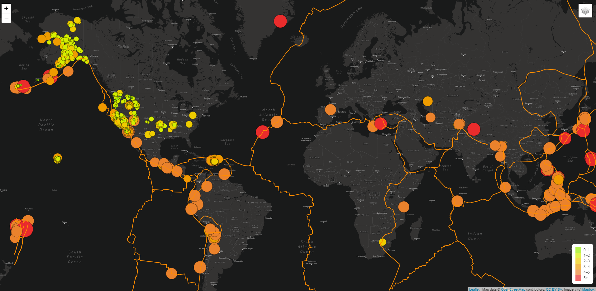

# Mapping_Earthquakes

## Module Project Overview

This project involves in plotting earthquake information obtained from USGS in geojson format for the last 7 days.

## Resources:
  - Data Source: 
    - https://earthquake.usgs.gov/earthquakes/feed/v1.0/summary/all_week.geojson
    - https://earthquake.usgs.gov/earthquakes/feed/v1.0/summary/4.5_week.geojson
    - https://raw.githubusercontent.com/fraxen/tectonicplates/master/GeoJSON/PB2002_boundaries.json
  - Software: JavaScript, HTML, CSS.
  - Library: D3, Leaflet.

## Challenge Overview

Using D3 data is extracted from the websites in geojson format and using leaflet the data is plotted using tile layers, base layers, layer groups, overlays, and map objects.

### Summary

  6 Different screenshots below show various options for the page.
  
  - Streets with all options
  
  
    
    
  - Satellite with all options
    
  
  
  
  - Dark with all options
    
  
  
  
  - Streets with tectonic options
    
  
  
  
  - Satellite with all earthquakes options
    
  
  
  
  - Dark with major earthquakes options
    
    
  
  
  
